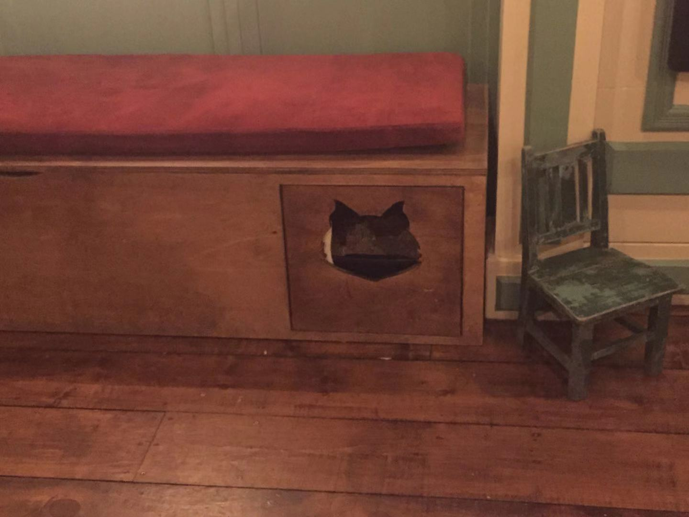

In this project, we were asked to “observe and document animal behavior and/or human-animal interaction at this location”, think about the tools and products involved in human-animal interactions, think about the whether they are human-centered or animal-centered, and see if we can develop a re-design of these products.

Yufei and I visited [Brooklyn Cat Cafe](https://www.catcafebk.com) in the afternoon of March 03, Sunday. It is also an adoption center, and all of their cats are saved from the streets, as they put it. We were told to clean our hands with sanitisers before being let in the space.

The space is a large room with a bar counter, multiple artefacts and toys for cats, and typical furnitures for a human living space (tables, sofas). Interestingly, there were also rat cages and a water tank for a turtle, reflecting the organisation’s interest in “saving not just cats but everyone”.

As we walked around and manoeuvred  between the swarm of customers and staff, we soon had an interesting observation: most of the artefacts were made for humans in a familiar human-centered spacial organisation (sofa, chairs, coffee table, etc), however, it seems as if the cats are the ones who have control over the space. They occupy these artefacts by laying on them and walking over them, while humans follow the cats and congregate at sites where the cats are. There was hardly any instance when humans were not occupied with the cats around them. 

We did a simple follow-up on the compositions of the space:

*** Animals:***
- cats: there were no patterns of behaviours of the cats - some were sleeping, some walking around, some being stroke by humans, some seem to have interactions with them. There seemed to be no general rules for where they should be or how they should behave - they were hidden behind plants, lying in the middle of shelves, spreading themselves on the sofas, pacing around on the floor…

- other species: there were three rat cages with rats sleeping, and a water tank with a turtle possibly hibernating. Little attention were paid to them by humans and cats.

***Humans：***

- Customers: apart from one or two lone customers, most visiting people were in groups of families, couples and friends. Occasionally some people stare at certain cats or stroke them on their own, but most people are walking around in the cafe, taking pictures of cats, and talking with their companions at the same time. 

- Staff: the identities of staff were not immediately discernible since they did not wear uniform, however, they are the ones who carry cats around and distribute food from the kitchen. They also seem to be the only people who would shat with each other without being fully preoccupied with cats’ activities.

We also overheard some comments and asked some brief questions to the staff, which gives us clues of human/animal-centered interactions and products.

A staff member told us that the cats here did not receive prior training to be in this cafe apart from receiving vaccinations and healthcare. They are not forced to do anything, so that the schedules and activities in the cafe are basically animal-centered. When I asked what happens when certain individuals stress out with so many people around, they told me these cats had the freedom to hide to an invisible place.

There is a space surrounded by glass with mats and wooden stairs, which is custom-made for the cafe to contain individuals who have not yet received vaccines. It is the most conspicuous space upon customer’s arrival, and the kittens in there attracted lots of people watching and admiring. 

Another custom-made artefact is a wooden structure which appeared as a sitting bench, but in fact has a cupboard-like structure where cats could enter and have access to cat litter basins. The cupboard can also be slid open, so that staff could easily life up and take the basin out for cleaning purposes. The staff we spoke with seems particularly proud of this artefact, because “**it is good for everyone**”: it is almost invisible to customers, accessible and functional to cats, and easy to be taken care of by staff.

We were also told that they would place a cap on visitors because when there are too many people around “it is hard for everyone”.

We came up with a few suggestions and/or designs to accommodate humans and animals:

*** Something more human-centered: ***

**A different shape of the sofas**: there were lots of sofas where cats slept on while human admirers squatted or stood beside them. We propose that a different sofa shape might allow both humans and animals to have some rest.

*** Something more animal-centered: ***
**Some sound-proof space for the cats**: for cats not enjoying human company, having the choice to hide does not equate to having the choice to relax. Hearing footstep and smelling strangers all the time may still stress them out. For this purpose, we thought it might be nice to have a completely animal-centred space free of human interference and noise.

**Something to play with/rest on at the top of the space**: the cafe’s structure is similar to a human-centered cafe where artefacts accumulate at places within human’s reach. At the same time, we noticed there are a few cats who prefer to hang around the roof. Having some interactive products around higher spaces might serve some enrichment purposes.

