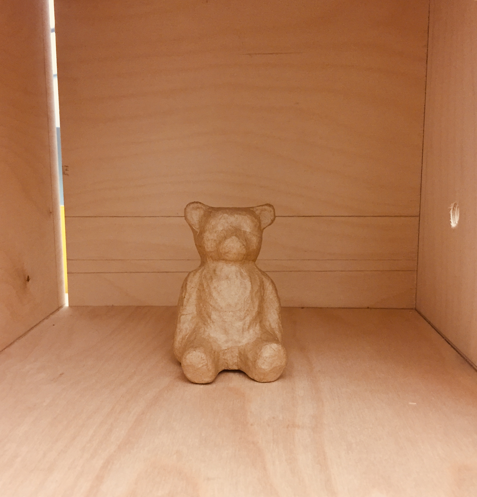

> Many workers have shown that these birds are able to do remarkable things virtually unheard of in other birds, let alone mammals, and have demonstrated "insight" rivalling that demonstrated in the great apes.

> Burghardt, *Genesis of Animal Play*

## Further research, findings, and relevance to our design

In our further research, Yufei and I are constantly amazed by the smart, sociality and playfulness of the Corvinae family. 

A documentary on crows showed that they can **recognise human faces** and **communicate new information** among individuals: an experimenter captured a crow wearing a specific mask; after that, when the experimenter walks with this mask, all crows have learnt to avoid him. The crows were not all eye-witness of the capturing event, so there must have been a communication mechanism among social groups. Similarly, when something destructive happened at a specific migratory path, the path would be avoided by the group for up to several years. These response provide overwhelming evidence for communication, collective actions and memories among the crow species.

A wealth of scientific studies on this well-loved creature also provide insights into their behaviour. For example, Henrich an Smolker (1998) have surveyed ravens' incredible neophilia, affinity and curiosity towards novel objects, including inedible, seemingly unfunctional objects: 

Burghart has reviewed that crows exhibit a wide range of *playful behaviours, those without direct benefit and without external stimuli*. For example, crows are seen to playfully chase each other, drop and catch non-food objects in their flight, play caching (hiding items), and rolling over in snow ([click here](https://www.youtube.com/watch?v=gjgpenWavO8) for a heart-melting video of this). This demonstrates the vast behavioural affordance of the Corvinae family, perhaps thanks to their generalist foraging approach and their complex brain structure. Supported by these research, we have a certain degree of confidence for their capability to engage with technological products instead of shunning from it or being indifferent. 

These research also tell us about their behavioural affordances and stimuli they are attracted to. Among others, we found that crows and birds in general are particularly attracted to **shiny objects, soft textures and items with holes which they can fit their mouths in**. In terms of responses and rooms for interaction, their most conspicuous and well-studied behaviour towards objects are **pecking**. This provides clear guidance towards our design: we would like to attract them by providing unusual, novel material stimuli, and create room for interaction by making our product responsive to pecking behaviours. 

## Second Brainstorming

Being impressed by the complexity of the Corvinae family’s casual understanding and memories, we realised that [our former ideas](/2019-03-07-week-8.md) designed for too simplistic outcomes (both being short, multimodal locomotive changes), and we run the risk for making crows bored and habituate to our product. How to create something that they might we willing to persistently and repetitively engage with? How to attempt communication with the crows via technological artefact?

Our first revised idea is inspired by the face-recognition experiment. What if we create a negative experience with a mask aside, then remove the negative experience? If the crow then reacts to the mask through **associative learning**, does the mask then become a communication vehicle?

Being a bit shaken by the ethical implications of designing for negative experience, we then tried to approach communication by designing visual patterns. If we **randomise a series of visual cues** as the crow presses a button, with food reward coming out from a device randomly, would the crow attempt to find a pattern? However, we were then worried that having a food reward would resemble too much **a classical conditioning experiment** or a **training device**. 

These brainstorms forced us to revisit the meaning and purpose of communication. Does any behavioural response from the animal count as communication? How to not confuse it as a one-off, goal-oriented behaviour, and how can we distinguish ourselves from animal trainers? This comes back to the question again: what is the point of designing technological artefacts for animals? What can be uniquely achieved by design? 

###### This bear in this space is our work-in-progress (will be explained later in case you find it intriguing at all), and also represents our inner state of crisis at the moment. 

After some serious (confusion and) discussion, we came up with the following criteria:

To communicate, the interaction between the user and the artefact has to be **back-and-forth**.

↓

We would try to separate exploratory communication from goal-oriented behaviour by **removing food rewards**.

↓

To provide intensive/motivation for interacting with the product, we need to think of some other stimuli - among face, colour and calling, we decide to develop from calling and design ***auditory engagements***.

↓

Communication between ravens occur within their own group. To associate our product with this behaviour, we will create something that **mimics a social, communicative other**, however not limited to their own species.

↓

Thus by setting our goal of our project as “initiating a conversation”, we are not aiming for a specific behaviour, but a **pattern** of back-and-forth interaction. 

↓

Crows and ravens have remarkable affordance of behaviours, but this probably also means they can get bored quickly if the artefact is not sophisticated enough. Thus we need a **multimodal** device.

## Explaining Our Prototype

Our idea is to design an artefact that will invite communication to our user crows. Since they are well known for (1) being curious about novel objects and (2) attend and help social companions, making noises that create social cues to attract users’ interest, we would like to make our prototype match with these features by creating something close to “a living creature”.

### Content

In order to achieve this, we would create a box with conspicuous, non-natural materials to add an element of “novelty”, as to trigger initial attention of the crows. 

There would be three actions of two categories that the crows can trigger response to, all involving the use of the mouth:

A. soft fabric connected to  piezo sensor A, so that arduino would responsd to pecking actions at this site

B. shiny object connected to piezo sensor B, effect being the same as A

C. a hole that fits the crow’s beak size so it could poke into the hole (proved to be attractive to birds), and a string poking out of it. 

More importantly, the box would react to the crow by a series of internal mechanisms (motions from within invisible to the crow), each corresponding to a body part of a bird-species, as if what comes from inside the box is a living, biologically similar individual:
1. Beak (wooden stick with a round tip)

2. Wings (fake feathers)

3. Claws (sharp and hard plastic stripes)
 
4. Body (a wooden object with certain weight)

Parts (1)(2) and (3) all operate in similar mechanisms: a frequency of servo movement is randomised, making the “beak” knock the wooden surface, while the claws and claws scratching at a changing, unpatterned way. When pecking at A and B occur, the frequencies of these movement will increase by  a factor of [?] for [?s] as a response to the sensory inputs.

Part (4) is different in terms that the movement is mediated by the string’s pulling motion exhibited by the crow itself. The string is attached to a servo rotating at a given rate; while the crow pulls the string, it will both feel the weight of the item, pulling force from the suspended strings, as well as the rotating force from the servo. These three forces together is meant to create a sense of complex locomotion that resembles a living being’s reaction to being pulled.

### Form, affordance

The materials used and forms of interaction we design all correspond to research evidence on crows’ behaviours. 

FIrstly, while a wooden, flat box would clearly appear as an artificial object in wilderness, which may trigger crows to peck all over it. The soft fabric on the wooden box are designed to invite site-specific pecking because bird species tend to engage with soft objects more than hard ones. For the string, the size of the hole which the string pokes out from specifically fits with that of a crow’s beak (6 * 2 * 1.5 cm, data collected from an experiment involving artificially extended crow beaks). This again fits with the research finding that birds like to peck wholes that their beaks can fit in.

The inner mechanism of the box is to mimic a living creature. We understand that creating a morphologically “living” object is technically unattatinable and loses the point of technological interaction, so we aim for **auditory cues** that hint for a living being within the box. We decided to use **objects attached with servo motors** instead of a microphone playing recorded sound because we believe digital sound has a texture that will be recognised hence alienated by the crows. 

As we move on, we also realise setting physical objects inside the box also creates **vibration, moving effects, etc.**, all translating into locomotions that suggest for interactive elements. Hence by programming for physical object orientation, although we do not leave much room for visual engagement with the crow, the auditory and haptic outputs of our product are rich, and since crows are expected to engage with pecking, this is essentially a **haptic interface**.

However, it is notable that our approach still comes with constraints. Although we selected materials for beaks, wings and claws based on “bodystorming”: repetitive testing and trying to decide for ourselves which sound resembles a bird’s sound the most. However, it is highly probable that crows have a much finer sensitivity and discrimination of different knocking and scratching noise, so their judgement of whether the noise inside is artificial and boring might be completely independent from our design intentions. 

And also, the noise generated from the rotating servos is not masked; its audio makes the box sound more mechanic, and this may be picked up by the crows and go either way: eliciting more curiosity or driving them away as it reduces the likelihood of having a living, communicative being inside the box

### Situation

This prototype is meant to introduce novelty, so it should be equally applicable at a wide range of habitats where crows appear: open lands with trees nearby, suburban areas and so on. As they prefer to be at open landscape, **the conspicuousness of our product should be guaranteed**. 
It is notable that crows’ playful behaviour are more frequent when the weather is warm so that crows are free from cold stress. This might make testing more ideal when **the environmental temperature is high**.

Given that spontaneous movements of the box’s inner part is the design to attract crows, we would prefer to place our product at **a relatively quiet place far from industrial noise**, so the auditory signals from the box will not be mixed and confounded with background noise. 

## Video explanation

Coming soon!

## What is the goal again?

The interactions from the artefact will have to take multiple forms and responsive, while behaviour from the crow will be unpredictable at first. However, by testing, recoding and analysing responses from the crows, we would ideally engage with an **iterative** process of design, in which we alter the artefact and explore what does it mean to communicate at the same time - the changes of the artefact’s form would thus be part of communication itself, shaped by us as well as the animal users. 

## Reference

Brazil, M. (2002). Common Raven Corvus corax at play; records from Japan. Ornithological Science, 1(2), 150-152. 
Burghardt, G. M. (2005). The genesis of animal play: Testing the limits. Mit Press.
Diamond, J., & Bond, A. B. (2003). A comparative analysis of social play in birds. Behaviour, 140(8), 1091-1116.
Crows : Documentary on The Intelligent World of Crows (Full Documentary). Retrieved on March 10 2019, from https://www.youtube.com/watch?v=zGYII1XbE4U&t=1966s 
Heinrich, B., & Smolker, R. (1998). Play in common ravens (Corvus corax). Animal play: Evolutionary, comparative, and ecological perspectives, 27-44.
Jelbert, S. A., Taylor, A. H., Cheke, L. G., Clayton, N. S., & Gray, R. D. (2014). Using the Aesop's fable paradigm to investigate causal understanding of water displacement by New Caledonian crows. PloS one, 9(3), e92895.
Matsui, H., & Izawa, E. I. (2017). Flexible motor adjustment of pecking with an artificially extended bill in crows but not in pigeons. Royal Society open science, 4(2), 160796.

