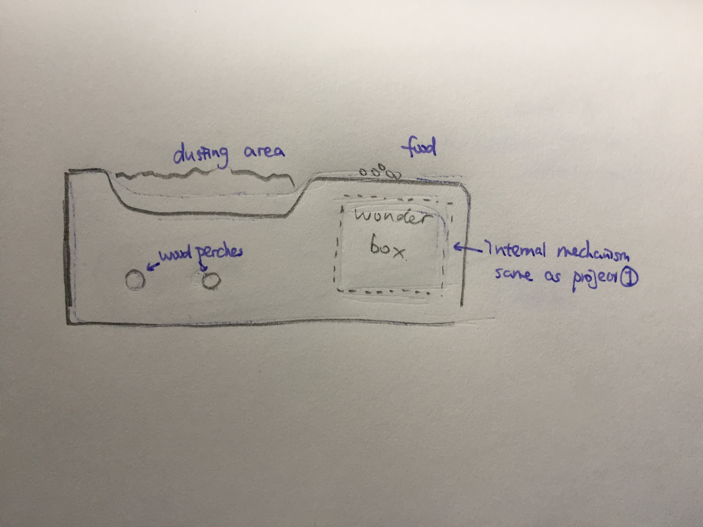
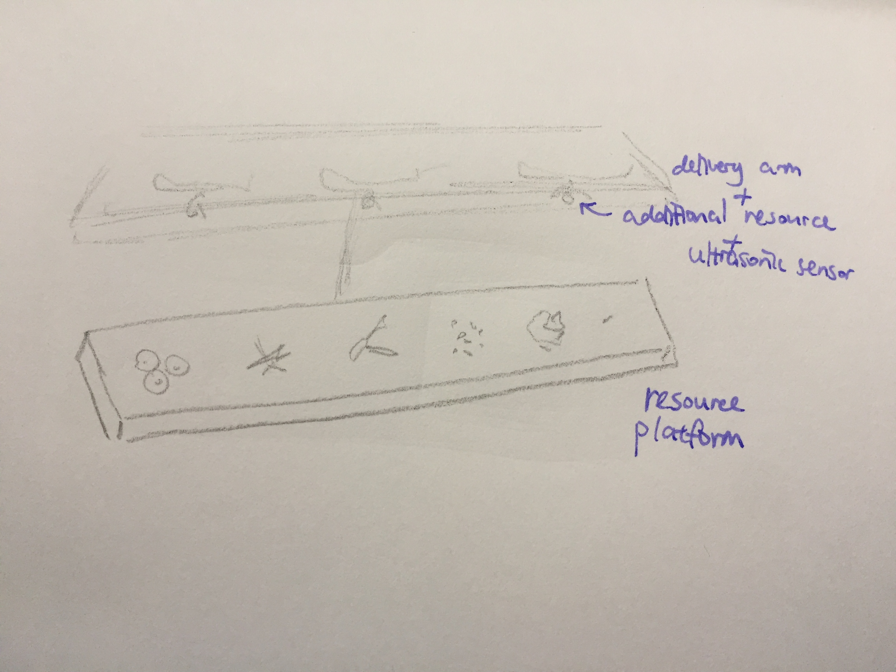

> In The Northern Darkness there is a fish and his name is Kun. The Kun is so huge I don't know how many thousand li he measures. He changes and becomes a bird whose name is Peng. The back of the Peng measures I don't know how many thousand li across and, when he rises up and flies off, his wings are like clouds all over the sky. When the sea begins to move, this bird sets off for the southern darkness, which is the Lake of Heaven.

> Zhuangzi “Free and Easy Wandering”, translated by Burton Watson. 

> In Memory of My Grandfather

In my final project, I would like to continue to develop my interest in bird species and think of two different directions for engagements.

### 1. Wonder box - engaging with “curious” species

This idea is a further elaboration of our mid-term prototype [curiosity box](/2019-03-26-week-10.md). In this project, [Yufei](https://jiuzhuario.github.io/safaris/) and I initially planned to engage with common crows and ravens, a species known for its boldness and playfulness. However, it is not an urban dweller hence not suitable for a design process oriented towards iterative field-testing. We were suggested to test our device with pet parrots, a species well known for its curiosity and cognitive complexity as well. In this case, I would replicate the curiosity box in a smaller size tailored towards parrots, with an ultimate goal of deploying it in wilderness with a wider range of intelligent bird species. 

A classmate has proposed to let us test with her friend’s pet parrot. If this works, then the design process will proceed by frequent testing and iteration. Starting with the shape of a box with internal mechanisms of sound and vibration making (largely the same as the mid-term prototype), I will aim to arrange extensive testing sessions, deploy multiple observation methods (ethogram, video recording, behavioural map, etc.), and develop methods for systematic analysis. I will then re-design the box based on the test; examples of changes could be incorporation of visual animations on the box (e.g. colour-changing screen), food delivery mechanisms, etc. I will aim for at least 1 field test each week followed by iterations.

<iframe width="560" height="315" src="https://www.youtube.com/embed/m76eVifGgSg" frameborder="0" allow="accelerometer; autoplay; encrypted-media; gyroscope; picture-in-picture" allowfullscreen></iframe>
 ###### Here is the vide of our last field testing.

Apart from user testing with birds and literature review on the behaviours of parrots and crows, I also need to consult animal experts, not only scientists but also pet owners and birdwatchers in parks. Learning from the latter is important because they develop their understandings of birds and sometimes communicate with them in a non-scientific trajectory. This might provide some new insights into building human-non-human relationship through design.

According to the [American Bird Conservatory](https://abcbirds.org/program/glass-collisions/bird-friendly-design/), the Bronx Zoo in New York is doing research on how birds react to different materials. While the research is to tackle birds’ glass collisions, if I could speak with them, I might gain some insight on birds levels of engagement with various materials, which could inform the design form of my prototype.

### 2. Wonder box 2 - engaging with city avians

A wonder box can also be altered for the purpose of engaging with city avians, more specifically with **common sparrows**. They are numerous in cities, have a general sense of fearlessness towards humans and man-made objects, making them easily accessible for field tests. With this subject, I may be able to arrange 2-3 field tests per week, or even more prolonged observations at the rooftop space of my apartment. This will make the iteration process more extensive within the limited time frame for this project. 

However, sparrows are less well known for curiosity and have an arguably lower interest for handling tools and engaging with play. As urban dwellers, they also live under different living conditions and may have a peculiar sense of territoriality and vigilance. Taking these into account, I will alter the purpose of the box less for engaging with curiosity but more towards creating a **safe environment** for engagement, at the same time playing with their species-specific behavioural traits. For example, sparrows are highly social and engage with **dust bathing** as a social activity. I could incorporate a dust or sand patch on the device to attract them coming, providing motivation for approaching the device. 

### 3. Resource delivery device 

Birdhouses are commonly built by bird watchers to attract birds; they are also built for enrichment purposes since human activities have taken away lots of natural habitats that would otherwise be ideal for nesting. Current designs of bird houses are mostly a wooden structure with tiled edges to avoid wetness and metal predator guards. I thought this is basic and has room for elaboration with some technology. 

A research piece by Gergely et al. (2015) show an experiment in which a remote-controlled car helps dogs gather food resources out of their reach. After several rounds, the dogs start to treat the car as a social partner. Can I design an artefact with similar effects but in wilderness towards birds?

The research above combined with the prevalence of birdhouse suggests for a possibility for a resource-delivery device as a communication vehicle. In this project, I could design a platform with an alignment of resources (food, nesting materials, rare materials, etc.), with a delivery device on top, covered with the shape of a birdhouse roof to make it less conspicuous to birds. After a certain amount of time when the resource is taken away, a new one will be dropped for continuous provision. In order not to create birds’ over-reliance of these resources, the total number of delivery will be constrained.

While the first goal of this device is to attract birds’ attention and make them take and use these resources for foraging, nesting and social purposes, the next step is to see whether they react solely to the resources or to the artefact itself as well. If the device is a mediating factor for resource delivery, would birds treat it as a social partner? Would patterns and frequency of food delivery then trigger certain behaviour from the birds? These would be the exploratory questions for this project.

