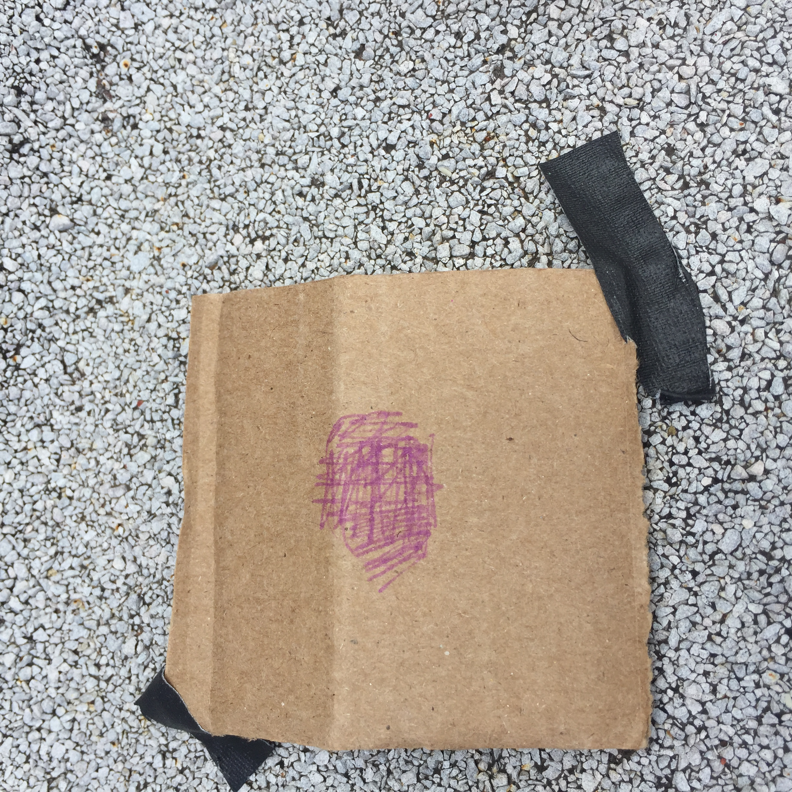

### Testing

Following the plan to further develop the curiosity box and learn from the [first prototype](/2019-03-26-week-10.md) in mid-term, Yufei and I decided to carry out a second field test in more “basic” ways, that is to not use a technological design yet, but simply to present birds with more basic objects.

The plan was to test birds’ behavioural tendencies by making a series of object available to them, and for this time, we chose an apartment terrace in Brooklyn where birds can be seen and heard from nearby trees and platforms. We hoped that by aligning the objects with food, we might find out what kind of objects are birds less afraid of and more likely to interact with.

Unfortunately, at implementation, both days had very bad weathers (wind + rain); it was barely tolerable for humans to stand still in the terrace, let alone the birds. Our literature review has shown that birds exhibit playful behaviours when there is less cold stress, so we could say that the two days we picked for testing was simply not desirable.

Below is the documentation of our two testing phases:

#### April 14 noon - April 15 morning

- Weather and environment: cloudy and windy, with showers at 5 pm, and thunder at around 5 am on April 15
- Basic approach: alignment of a series of objects, each representing part of the curiosity box’s attraction factors, and putting food alongside them
- Objects aligned:
  - cardboard with big hole (fits into the beak of a crow)
  - cardboard with small hole (fits into the beak of a sparrow/pigeon)
  - cardboard with red and yellow stickers
  - cardboard with a pulley
  - a mirror
- Food used:
  - chocolate & almond flavoured cereals
  - protein bar (crushed with hand)
  - rice
- Photos:

What happened:
In the wind we sat for about 20 minutes and saw no birds coming. We decided to go back indoors and check once before sunset, and once at sunrise on the second day.
At sunset, one cardboard is blown away and another is displaced. Food before the mirror and the pulley had different distributions, but could not tell if it was animals or the wind.

In the morning on the second day, it was after a very heavy rain and all cardboards have disappeared; the mirror was found at another side of the terrace. The food on the floor were all deformed by water. 

#### April 15 afternoon - April 16 morning

- Weather and environment: cloudy and windy (more windy than yesterday; we could barely stand up); no birds spotted 

- Basic approach: placement of food behind/within the object of interest, so that birds would have to access the food within or by getting past the object; everything taped on the ground to avoid being blown away
- Objects aligned: 
  - box with various food placed inside (shape resembling curiosity box prototype)
  
  - cardboard with big hole (fits into the beak of a crow)
  
  
  - cardboard with small hole (fits into the beak of a sparrow/pigeon)
  
  - cardboard with a pulley
  
  - cardboard with a patch of purple paint
  
  - metal tray with food placed within
  
  - packaging material of the protein bar
  
- Food used:
  - mainly protein bar because it’s heavier and sticky hence less likely to be blown away by wind
- Photos:
  
- What happened:
things still get blown away, and no interaction still

### Future action plan

**Running indoor tests in tandem**
We chose to use the terrace and test with city avians because we assumed to be the most accessible option, however, it is almost impossible to look for any interaction when the weather isn’t good. Given the short time we have left, we need to think of ways to reach out for indoor testing with domesticated birds too, despite them being different species.
- Institutions for reaching out: 
  - [Hallett Nature Sanctuary](http://www.centralparknyc.org/things-to-see-and-do/attractions/hallett-nature-sanctuary.html) (central park)
  - [Riverside Park Bird Sanctuary](https://riversideparknyc.org/places/riverside-park-bird-sanctuary/)

**More research / consulting animal experts**
- There is research at the Bronx Zoo sponsored by American Bird Conservatory on birds’ reactions to different materials. We will reach out to ask them share with us their findings.
- If we are to keep engaging with city avians, there is an entire book on house sparrows, from genetics to population dynamics. We are still waiting for the New School library to process our loan request.
- Tim Todds wrote a book on sparrows and humans relationship with them. 

**Further alternations of testing settings** (with potential to incorporate into future prototypes)
- Tracing animal activities:
if we continue to test with city avians on the terrace, it is unfeasible to by physically present all the time; we might cover the surfaces of the testing area with fine sand or plasticine, so that footprints of the animal may be left.
- Making test site conspicuous:
people commonly use bird houses to attract birds they like. All pictures and guidelines online have their birdhouses sticked up from the ground or suspended from rooftop. While this might be designed for nesting purposes, it might also struck as being more visible to birds than having them on the ground. The morphology would also be closer to a tree branch where they are usually found. 
- Being mindful of birds’ behaviours:
sparrows are known as very aggressive and territorial species, so we might increase the spacing between objects, and if develop into a suspended platform, increase the size of it so there is enough space for multi-individual engagements
sparrows bath in dust frequently. We could prepare a box of fine sand or soil beside as an attraction factor

