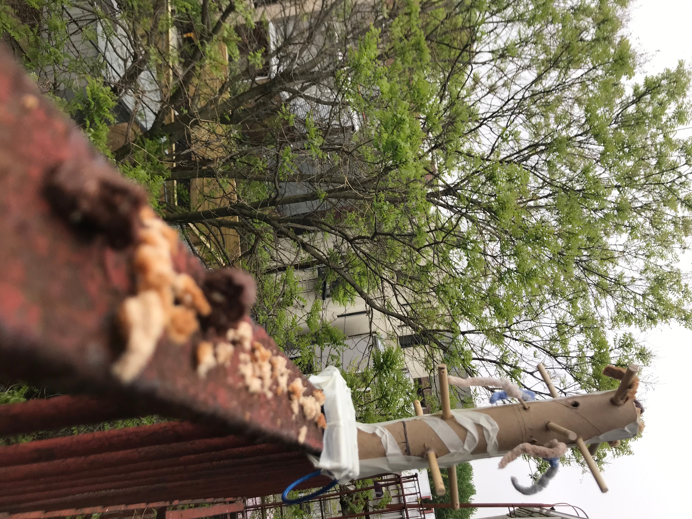
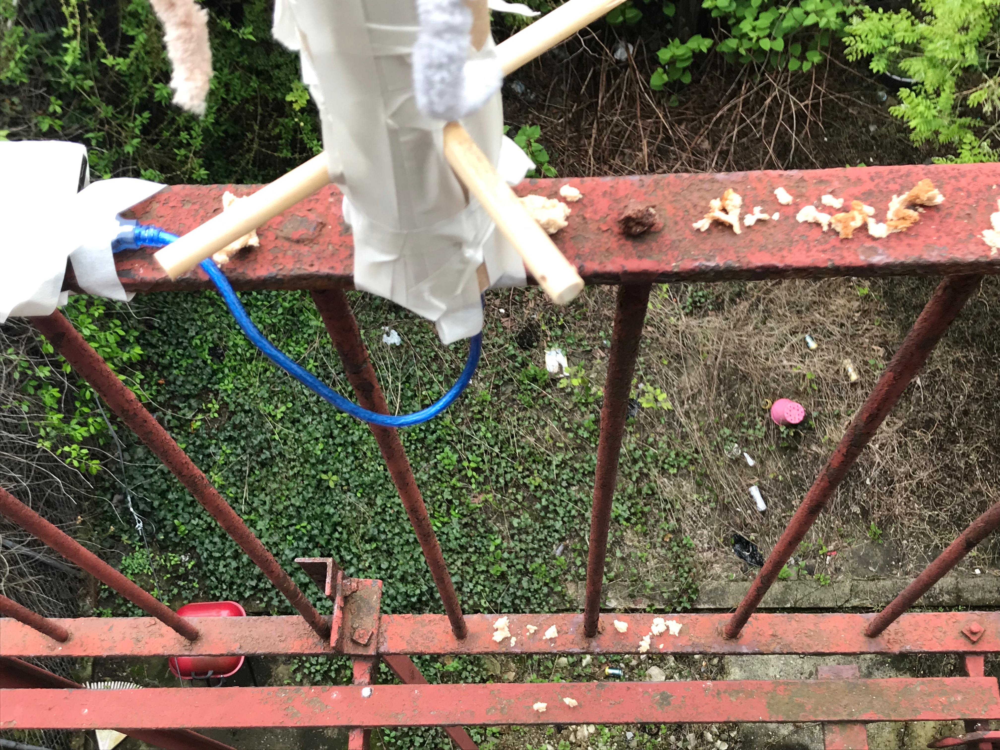
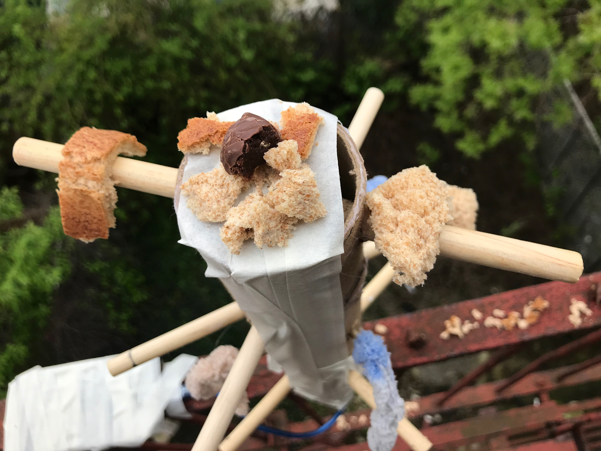

**Final Project Rendering**

For our final project, yufei and I made major modifications of the form and context for our curiosity box  from the [mid-term prototype](2019-03-26-week-10.md). We gathered two major advices from the critique & feedback sessions in class:
Foraging behaviours might be better utilised for getting **continuous interactions**. We could search for videos of city avians foraging (e.g. pecking at worms out of a hole) for information.
A branch shape might be more attractive to birds, since it is where they usually stand. 
Try to hang the device up i the tree so there is coverage from the other branches where birds might feel safer to interact with.
Birds are extremely visual species, so we might make use of something visually conspicuous to interact with them.

In our final project, we were able to follow (1) (2) and (4) and design an interactive element that visually mimics the moving motion of worms, using colourful strings as a visual reference:

Though the forms have changes a lot, our conceptual goal of the project remains the same: *To engage with the curiosity of multiple species of city avians and aim for continuous interactions.*

**Field Test**
To set out our field test, we ended up tying it up on a balcony in a Brooklyn apartment, so that one of us can keep the device in sight. 

1. we’ve tried 2 different food types (chocolate & bread crumbs) to test for food preference just in case we would have food left by the end of the experiment. [they ate everything]
2. we placed the crumbs out to short and long distance to the left and right of the bird hotel. to test for the approximate distance out to which they are comfortable approaching the device [see 3]
3. we put a prize chocolate piece (about the same size as the other pieces scattered elsewhere around the hotel). cam records show that this is the first chocolate piece grabbed by a bird [perhaps they went for 
the higher location, but it shows that they are not afraid to land on the hotel] 
4. we also put food right beneath the railing on which the bird hotel was placed. if no bird had landed on the railing but one or more would land on the floor level it would mean they are not comfortable with the hotel nor the power, nor approaching it from the sides. 
5. lastly, we placed crumbs away from the scene to test if the birds would eat these but avoid the rest of the setup. 

 

**Environmental conditions & effects: **

1. Rain - rain differentiated between light and heavy but didn’t take the food away. 
We had to place a plastic bag cover around the bird hotel to prevent it from soaking too wet. Cam records show that a bird approached and ate some food around even with the bag on. 
2. But during the heavy rain we had to remove the battery to protect equipment. This meant the ‘worms’ had stopped moving. but even then birds came and landed on it — meaning that the ‘moving worms’ is not necessarily (at least not all the time) the reason why they came close to the hotel. photo: bird that comes with the bag on
It took about half a day for the first bird to land on it.

**Activity observation: **

The first interaction occured in an afternoon, and the longest interaction occured in similar times for as long as 10 minutes. The camera records at least 2 instances of interactions in the following days, even though there were not food any more. 
there was a bird who landed on it directly to pick at the ‘worms’. meaning it piqued their curiosity. 
photo: the bird that came at 6.02pm

3. we are certain that it attracted the same species of bird. we can’t necessarily be certain if it’s the same bird or not given the outdoor nature of the experiment but cam records show that the bird has similar features every time it appears so it’s likely that it’s the same bird who got accustomed to the device. however, it didn’t take time to get gradually closer. there were still some food left around the device when the food at the top was finished.

<iframe width="560" height="315" src="https://www.youtube.com/embed/cNtWKa-5UHs" frameborder="0" allow="accelerometer; autoplay; encrypted-media; gyroscope; picture-in-picture" allowfullscreen></iframe>

**Future Iterations:**

1. Further testing at multiple sites
- there are circumstances specific to our test site: our neighbour’s cat always staring out of the window, possible domination by one species…
- we do not aim to control for all environmental factors, but testing at more places help with a fairer analysis of our device itself
 2. Removal of the lower stands
- the gap between the stand only allows for specific species of birds to land, and have not been - used at all during the three days of testing
3. Potential for designing for a specific species or individual
- the device seems to attract a particular species of big birds
- our current recording shows initial interactions, but longer observations and ethogram methods might tell us why exactly does this species show up, and what parts of the device they would like to interact with
- More observation could also reveal directions for further addition of interactive elements

